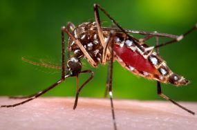

Authors: Seth Bergstedt, Taylor Christian, Chris Wojan 

<h3>Motivation</h3>

 
Mosquitoes are insects of interest in regards to ecology, as well as public health. In the United States, the incidence of mosquito-borne diseases in humans is highly variable across years (Rosenberg et al. 2018). Investigating population trends over space and time can lead to a better understanding of these patterns in incidence. Further, research in this area can help illuminate changes in both ecological health of a region, as well as guide public health decisions regarding species control of problem mosquitoes. 
  

<h3>Data Source

The data used in this project was mosquito trapping data from the National Ecological Observatory Network (NEON). More information can be found in the data tab.

  
<h3>Questions</h3>

1. How does overall mosquito biomass and species richness change over the course of the year, and how does that vary across US regions? (Spatial and Seasonal Trends)  
 
2. How do the biomass of mosquitoes collected and number of mosquitoes identified by genus nationwide vary by year? (Annual Trends)  
 
3. How abundant are medically important mosquitoes throughout the US, and how prevalent are mosquito-borne pathogens? (Pathogen Vectors)  
 
4. At what precision were mosquitoes identified and how does that vary in time and space? (Taxonomic Precision)  

<h3>Analysis Approach</h3>

- Download NEON mosquito CO2 trapping data and pathogen ID data from the NEON API.  
- Download shapefile of NEON domains from NEON website.  
- Calculate variables of interest in mosquito data.  
- Summarize variables by domain, month, year depending on question.  
- Join summary data with domain polygon shapefile.  
- Draw maps and figures displaying trends.  

<h3>Summary of Results</h3>

1. Spatial and Seasonal Trends:   
- Biomass is highest in the Great Lakes and Tundra Domains, with seasonal peaks in July.  
- Species Richness is highest for the domains in the Southeast US, such as the Southern Plains.  
 
2. Annual Trends:  
- Mosquito biomass/hr and genera proportions are fairly consistent over the years.  
 
3. Pathogen Vectors:  
- Disease vectors are most common in the Northern Plains Domain, and positive tests for pathogen were most common for the Great Lakes Domain.  
 
4. Taxonomic Precision:  
- Many mosquitoes in the Alaskan domains were only IDed to genus, while many mosquitoes in the Northeast Domain were identified all the way to subspecies.  

<h3>Acknowledgments and References</h3>

'The National Ecological Observatory Network is a program sponsored by the National Science Foundation and operated under cooperative agreement by Battelle. This material is based upon work supported by the National Science Foundation through the NEON Program.' - [https://www.neonscience.org/data-samples/data-policies-citation]    

Rosenberg, R., N. P. Lindsey, M. Fischer, C. J. Gregory, A. F. Hinckley, P. S. Mead, G. Paz-Bailey, S. H. Waterman, N. A. Drexler, G. J. Kersh, H. Hooks, S. K. Partridge, S. N. Visser, C. B. Beard, and L. R. Petersen. 2018. Vital Signs: Trends in Reported Vectorborne Disease Cases — United States and Territories, 2004–2016. MMWR Morb. Mortal. Wkly. Rep. 67: 496–501.

